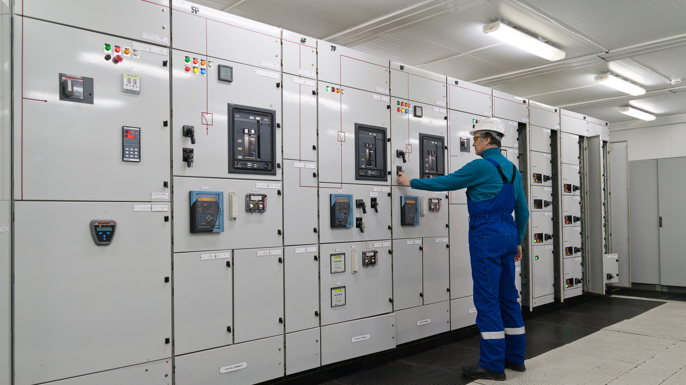

<!-- PROJECT LOGO -->
 

  

 
 

<!-- BACKGROUND & TITLE -->

  
  <h3 align="center">Power Systems Analysis</h3>
 

<!-- TABLE OF CONTENTS -->
## Table of Contents

* [**Notes**](https://github.com/MDBrodskiy/Power_Systems/tree/master/Notes/)
    * [**Lecture 1**](https://github.com/MDBrodskiy/Power_Systems/tree/master/Notes/Lecture1.pdf)
    * [**Lecture 2**](https://github.com/MDBrodskiy/Power_Systems/tree/master/Notes/Lecture2.pdf)
    * [**Lecture 3**](https://github.com/MDBrodskiy/Power_Systems/tree/master/Notes/Lecture3.pdf)
    * [**Lecture 4**](https://github.com/MDBrodskiy/Power_Systems/tree/master/Notes/Lecture4.pdf)
    * [**Lecture 5**](https://github.com/MDBrodskiy/Power_Systems/tree/master/Notes/Lecture5.pdf)
    * [**Lecture 6**](https://github.com/MDBrodskiy/Power_Systems/tree/master/Notes/Lecture6.pdf)
    * [**Lecture 7**](https://github.com/MDBrodskiy/Power_Systems/tree/master/Notes/Lecture7.pdf)
    * [**Lecture 8**](https://github.com/MDBrodskiy/Power_Systems/tree/master/Notes/Lecture8.pdf)
    * [**Lecture 9**](https://github.com/MDBrodskiy/Power_Systems/tree/master/Notes/Lecture9.pdf)
    * [**Lecture 10**](https://github.com/MDBrodskiy/Power_Systems/tree/master/Notes/Lecture10.pdf)
    * [**Lecture 11**](https://github.com/MDBrodskiy/Power_Systems/tree/master/Notes/Lecture11.pdf)
    * [**Lecture 12**](https://github.com/MDBrodskiy/Power_Systems/tree/master/Notes/Lecture12.pdf)
    * [**Lecture 13**](https://github.com/MDBrodskiy/Power_Systems/tree/master/Notes/Lecture13.pdf)
    * [**Lecture 14**](https://github.com/MDBrodskiy/Power_Systems/tree/master/Notes/Lecture14.pdf)
    * [**Lecture 15**](https://github.com/MDBrodskiy/Power_Systems/tree/master/Notes/Lecture15.pdf)
* [**Homework**](https://github.com/MDBrodskiy/Power_Systems/tree/master/Homework/)
    * [**Homework 1**](https://github.com/MDBrodskiy/Power_Systems/tree/master/Homework/Homework1.pdf)
    * [**Homework 2**](https://github.com/MDBrodskiy/Power_Systems/tree/master/Homework/Homework2.pdf)
    * [**Homework 3**](https://github.com/MDBrodskiy/Power_Systems/tree/master/Homework/Homework3.pdf)
* [**Labs**](https://github.com/MDBrodskiy/Power_Systems/tree/master/Labs/)
    * [**Lab 1**](https://github.com/MDBrodskiy/Power_Systems/tree/master/Labs/Lab1.pdf)
    * [**Lab 2**](https://github.com/MDBrodskiy/Power_Systems/tree/master/Labs/Lab2.pdf)
    * [**Lab 3**](https://github.com/MDBrodskiy/Power_Systems/tree/master/Labs/Lab3.pdf)
    * [**Lab 4**](https://github.com/MDBrodskiy/Power_Systems/tree/master/Labs/Lab4.pdf)

<!--
  * [**Chapter 1**](#Notes/Chapter\ 1)
* [**Exams**](#Exams)
* [**Projects**](#Projects)
-->

An assortment of lecture notes and exams from Northeastern University's EECE5682 (Fall 2024)
    
Open sourced **LaTeX** Templates [here](https://www.latextemplates.com/).
 
**TikZ** diagram editor [here](https://www.mathcha.io/editor).
 
**TikZ** examples [here](https://www.texample.net/tikz/example).
 
**LaTeX** draw [here](https://www.latexdraw.com/).
     
Authentication:   
    <pre>to receive commit access to this repository e-mail Michael@Brodskiy.com for credential verification/authorization</pre>

Cloning This Repository
 &nbsp;&nbsp;with **command line interface**:
    <pre>    
    **$** git clone https://github.com/MDBrodskiy/Power_Systems.git    
    **$** **>**  **_**
    </pre>
